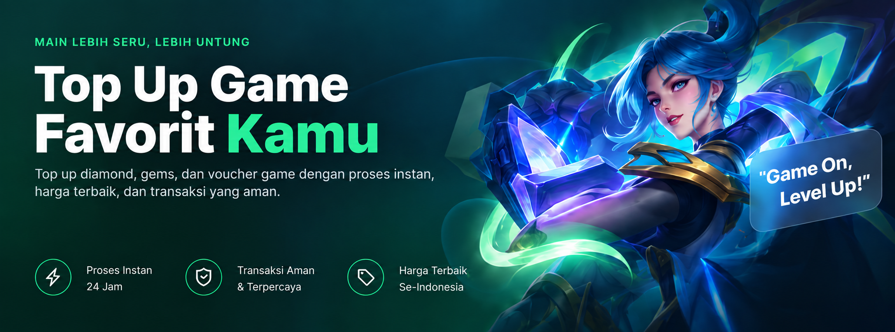

<div align="center">


# Juevix

### Top Up Game, Lebih Mudah

**Platform top up diamond, gems, dan voucher game favorit kamu.  
Proses instan 24 jam, harga termurah, transaksi aman.**

<br>

[](https://nextjs.org)
[](https://react.dev)
[](https://typescriptlang.org)
[](https://tailwindcss.com)

<br>

[](#)
[](#)
[](#)

</div>

---

## Preview

<div align="center">



</div>

---

## Fitur Utama

<table>
  <tr>
    <td align="center" width="90">
      
    </td>
    <td>
      <b>Game Catalog</b><br>
      Katalog game lengkap dengan filter kategori & platform
    </td>
  </tr>
  <tr>
    <td align="center">
      
    </td>
    <td>
      <b>Instant Top Up</b><br>
      Proses top up otomatis dalam hitungan detik
    </td>
  </tr>
  <tr>
    <td align="center">
      
    </td>
    <td>
      <b>Multi Pembayaran</b><br>
      QRIS, e-wallet (DANA, OVO, GoPay, ShopeePay), VA, minimarket
    </td>
  </tr>
  <tr>
    <td align="center">
      
    </td>
    <td>
      <b>Cek Nickname</b><br>
      Verifikasi ID game sebelum bayar
    </td>
  </tr>
  <tr>
    <td align="center">
      
    </td>
    <td>
      <b>Cek Transaksi</b><br>
      Lacak status pesanan real-time dengan invoice
    </td>
  </tr>
  <tr>
    <td align="center">
      
    </td>
    <td>
      <b>Responsive</b><br>
      Mobile-first design, sempurna di semua device
    </td>
  </tr>
  <tr>
    <td align="center">
      
    </td>
    <td>
      <b>Dark Theme</b><br>
      UI gelap premium dengan aksen neon hijau
    </td>
  </tr>
</table>

---

## Halaman

| Route | Halaman |
|-------|---------|
| `/` | Homepage — Hero slider + katalog game |
| `/game/[slug]` | Detail game — Pilih nominal & metode bayar |
| `/pembayaran` | Halaman pembayaran dengan countdown timer |
| `/cek-transaksi` | Tracking status transaksi via invoice |

---

## Tech Stack

<div align="center">

| | Tech | Versi |
|---|------|-------|
|  | **Framework** | 16 (App Router + Turbopack) |
|  | **UI Library** | 19 |
|  | **Styling** | 4 |
|  | **Animation** | 13 |
|  | **Slider** | 14 |
|  | **Language** | 5 |
|  | **Display Font** | Sora |
|  | **Body Font** | Plus Jakarta Sans |

</div>

---

## Getting Started

```bash
# Clone
git clone https://github.com/ersetdigital-sudo/-Juevix.git
cd -Juevix

# Install dependencies
npm install

# Run dev server
npm run dev
```

Buka [http://localhost:3000](http://localhost:3000)

---

## Project Structure

```
src/
├── app/
│   ├── page.tsx              # Homepage
│   ├── layout.tsx            # Root layout
│   ├── globals.css           # Global styles
│   ├── game/[slug]/page.tsx  # Game detail
│   ├── pembayaran/page.tsx   # Payment page
│   └── cek-transaksi/page.tsx# Transaction tracker
├── components/
│   ├── Header.tsx            # Navigation header
│   ├── Footer.tsx            # Footer
│   ├── BottomNav.tsx         # Mobile bottom nav
│   ├── HeroSlider.tsx        # Hero banner slider
│   ├── GameGrid.tsx          # Game catalog grid
│   ├── Sidebar.tsx           # Category sidebar
│   └── JxLogo.tsx            # Brand logo
└── data/
    └── games.ts              # Game data & config
```

---

## Brand Identity

<table>
  <tr>
    <td><b>Brand</b></td>
    <td>Juevix</td>
  </tr>
  <tr>
    <td><b>Tagline</b></td>
    <td>Top Up Game, Lebih Mudah</td>
  </tr>
  <tr>
    <td><b>Primary Color</b></td>
    <td><code>#00D97E</code> (Neon Green)</td>
  </tr>
  <tr>
    <td><b>Dark Base</b></td>
    <td><code>#04251a</code></td>
  </tr>
  <tr>
    <td><b>Font Display</b></td>
    <td>Sora</td>
  </tr>
  <tr>
    <td><b>Font Body</b></td>
    <td>Plus Jakarta Sans</td>
  </tr>
</table>

---

## License

MIT © [Erset Digital](https://github.com/ersetdigital-sudo)
